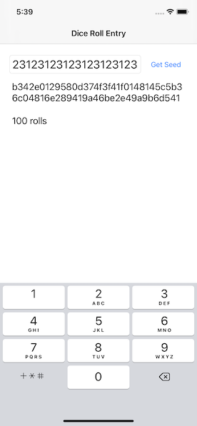
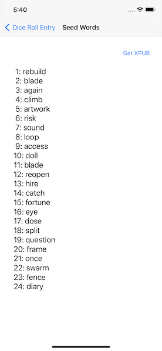
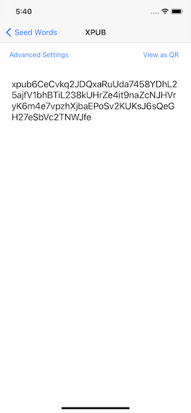
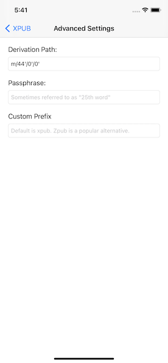

# Dicer
iOS Application for generating a Bitcoin seed phrase and xpub from dice rolls. Useful for verification of dice rolls used on other devices.

Steps for use:
1) Compile & install this application on an iOS device.
2) Begin initializing a bitcoin hardware device that supports dice roll entropy.
3) Enter each roll of the die into the bitcoin hardware device and iOS device simultaneously.
4) The hash will update on both screens. If the hashes fail to match, you've made some mistake and probably need to start over.

5) Tap `Get Seed` to see the generated seed words. Ensure these match the seed words on the bitcoin hardware device.

6) Tap `Get XPUB` to see the generated xpub. Ensure this matches the xpub on the bitcoin hardward device. If they do not match, see the ***Additional Note*** at the bottom of this guide.

7) **MOST IMPORTANT STEP**: Tap `View as QR` to see the xpub render. Scan the QR code and enter the value into a read-only wallet. A popular one is [Electrum](https://bitcoinelectrum.com/creating-a-watch-only-wallet/) but other options exist as well. Use this wallet for generating receiving adresses *instead* and/or in conjunction with of your bitcoin hardware wallet software. Verification of receiving addresses before moving funds is crucial -- the more ways you verify, the better.

**Additional Note**

If the xpub does not match and /or you need a different format (like say Zpub) you will need to tap `Advanced Settings`. This page allows you to adjust various setting including derivation path, passphrase, and prefix. See your bitcoin hardware wallet documentation for help with these values -- they must match the values your bitcoin hardware device is using exactly. This means cAsE sEnSaTiVe as well as the very small single quote marks `'`.

